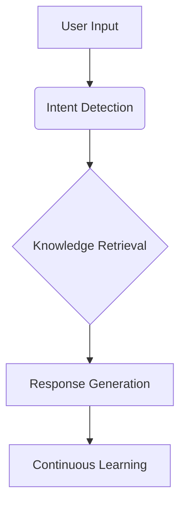

# 🌟 What AI Chat Support Does: Revolutionizing Customer Service

AI chat support transforms how businesses interact with customers by providing **instant, accurate, and scalable** assistance. Unlike traditional human-only support, AI-powered chatbots and virtual assistants leverage **natural language processing (NLP), machine learning (ML), and automation** to enhance efficiency, reduce costs, and improve customer satisfaction.

## 🚀 Key Functions of AI Chat Support

### ⏱️ 1. Instant, 24/7 Customer Assistance
- 🕒 Responds to customer queries **in real-time**, eliminating long wait times
- 🌐 Available **24/7** across multiple channels (website, social media, messaging apps)

### ⚙️ 2. Automated Issue Resolution
- 🤖 Handles **frequently asked questions (FAQs)** like order status, returns, and account updates
- ✅ Resolves **L1 (basic) and L2 (moderate) support issues** without human intervention

### 🎯 3. Smart Ticket Triage & Routing
- 🔍 **Classifies and prioritizes** support requests based on urgency and complexity
- 👩💼 Escalates **high-priority or complex issues** to human agents with full context

### 🎨 4. Personalized Customer Interactions
- 👋 Recognizes returning customers and **retains conversation history** for context-aware replies
- 📊 Uses CRM data (purchase history, past tickets) to **tailor responses**

### 🔮 5. Proactive Support & Recommendations
- 📅 **Anticipates customer needs** (e.g., renewal reminders, product suggestions)
- 😠 Detects frustration in conversations and **offers live agent handoff** when needed

### 🌍 6. Multilingual & Omnichannel Support
- 🗣️ Communicates in **multiple languages** without extra setup
- 📱 Provides **consistent support** across email, chat, WhatsApp, and social media

## 🔄 How AI Chat Support Works

# 🤖 AI-Powered Customer Support Showdown: How Twig Outperforms the Competition

Customer support is evolving rapidly, and AI is at the forefront of this transformation. While many AI support tools exist — such as **Zendesk AI**, **Intercom Fin AI**, **Freshdesk Freddy AI**, and **Ada** — they often fall short in delivering true intelligence, adaptability, and seamless integration.

**Enter Twig**, a next-generation AI support system that learns in real-time, retains context, and provides autonomous, branded customer service across all channels.

Below, we compare the top AI support solutions and highlight why Twig stands out as the most advanced, customer-centric AI support platform.

---

## 🧾 Comparison: Top AI Support Solutions vs. Twig

| **Feature**               | **Zendesk AI**            | **Intercom Fin AI**       | **Ada**                     | **Twig**                                       |
|---------------------------|---------------------------|---------------------------|---------------------------|-----------------------------|------------------------------------------------|
| **Real-Time Learning**    | ❌ Pre-defined workflows   | ❌ Limited adaptation      | ❌ Rule-based responses       | ✅ Learns from every interaction                |
| **Context Retention**     | ⚠️ Basic session memory    | ⚠️ Short-term memory       | ⚠️ Limited retention          | ✅ Remembers full conversation history         |
| **Deep CRM Integration**  | ✅ With Zendesk Suite      | ✅ Works with Intercom     | ⚠️ API-dependent              | ✅ Seamless sync with any CRM                  |
| **Autonomous Resolution** | ⚠️ Agent-assisted          | ✅ Simple deflection       | ✅ Repetitive queries         | ✅ Human-like resolution, fully autonomous     |
| **Personalization**       | ⚠️ Basic user data         | ✅ Uses past interactions  | ✅ Scripted personalization   | ✅ Dynamic, memory-driven personalization      |
| **Omnichannel Support**   | ✅ Email, chat, voice      | ✅ Chat, email, social     | ✅ Web & mobile channels      | ✅ Unified experience across all platforms     |
| **No-Code AI Training**   | ❌ Manual setup required   | ✅ Drag-and-drop builder   | ✅ No-code interface          | ✅ Self-learning, zero manual effort           |
| **Proactive Support**     | ❌ Reactive only           | ⚠️ Basic event triggers    | ❌ FAQ-driven interactions    | ✅ Anticipates and solves issues proactively   |
| **Pricing**               | $$$ Enterprise-tier        | $$ Mid-range              | $$ Agent-based             | $$$ Volume-based             | ✅ Flexible, ROI-optimized pricing model       |

---

## 💡 Why Twig Outperforms the Competition

### 1. Real-Time Learning & Adaptation  
Unlike Zendesk AI and Freshdesk Freddy AI, which rely on static, pre-configured scripts, **Twig learns continuously** from every customer interaction. It adapts to industry-specific language, slang, and tone, ensuring more accurate, natural conversations.

### 2. Deep CRM & Knowledge Base Integration  
While Intercom Fin AI and Ada support CRM connectivity, **Twig integrates natively and deeply** with systems like Salesforce, HubSpot, Zendesk, Notion, Airtable, and custom sources — pulling in dynamic data without any extra setup.

### 3. Autonomous, Branded Customer Service  
Ada supports scripted automation, but **Twig executes complex tasks** like processing refunds, checking order status, and updating CRM records — all without manual escalation. Think of it as a fully trained support rep that works 24/7.

### 4. Omnichannel, Consistent Experience  
Zendesk and Intercom support various channels, but **Twig offers a unified support experience** across chat, email, social, and voice — with persistent context and no repetitive handoffs.

### 5. Proactive & Predictive Support  
Most AI tools respond reactively to user queries. **Twig goes further**, anticipating needs and surfacing relevant support before the customer even asks — reducing ticket volume and boosting satisfaction.

---

## ✅ The Bottom Line: Twig is the Future of AI Support

- ✅ **Smarter** – Learns in real-time, adapts to customer behavior  
- ✅ **More Integrated** – Seamless CRM, database, and API integrations  
- ✅ **More Autonomous** – Resolves tickets end-to-end without humans  
- ✅ **More Personalized** – Understands and remembers customers  
- ✅ **More Scalable** – Cuts costs by 50%+ and improves CSAT scores

---

## 🚀 Ready to Transform Your Customer Support?

**Your customers deserve better. Upgrade to Twig today.**

- 🔄 **Try Twig Free** – No credit card required  
- 📞 **Book a Demo** – See Twig in action

---

